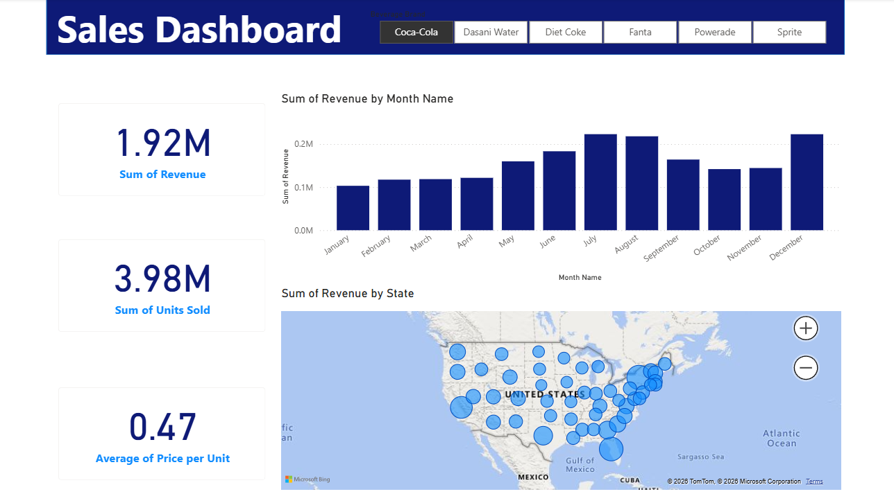

# PowerBI-Beverage-Sales-Dashboard
Sales analytics dashboard built in Power BI with DAX, Power Query, and interactive visualisations.
# Beverage Sales Dashboard | Power BI

## Overview

This project is an interactive Power BI dashboard developed to analyse beverage sales performance across the United States. It provides key business insights into revenue, units sold, monthly sales trends, and state-wise performance through dynamic visualisations and interactive filters.

## Dashboard Preview



## Key Metrics

- Total Revenue
- Total Units Sold
- Average Unit Price

## Features

- Interactive brand slicer
- Monthly revenue trend analysis
- State-wise sales distribution using map visualisation
- KPI cards for quick business insights
- Clean and user-friendly dashboard layout

## Tools & Technologies

- Power BI
- Power Query
- DAX
- Microsoft Excel

## Dataset

The dashboard is built using a beverage sales dataset containing information such as:

- Brand
- Revenue
- Units Sold
- Price per Unit
- State
- Month

## Business Insights

- Compare sales performance across different beverage brands.
- Identify monthly revenue trends and seasonal patterns.
- Analyse geographical sales distribution across US states.
- Monitor overall business performance using key KPIs.

## Repository Contents

```
├── Beverage Sales Dashboard.pbix
├── Dataset.xlsx
├── dashboard.png
└── README.md
```

## Skills Demonstrated

- Data Cleaning
- Data Modelling
- DAX Calculations
- Power Query
- Data Visualisation
- Dashboard Design
- Business Intelligence

---

If you found this project interesting, feel free to explore the dashboard and provide feedback.
